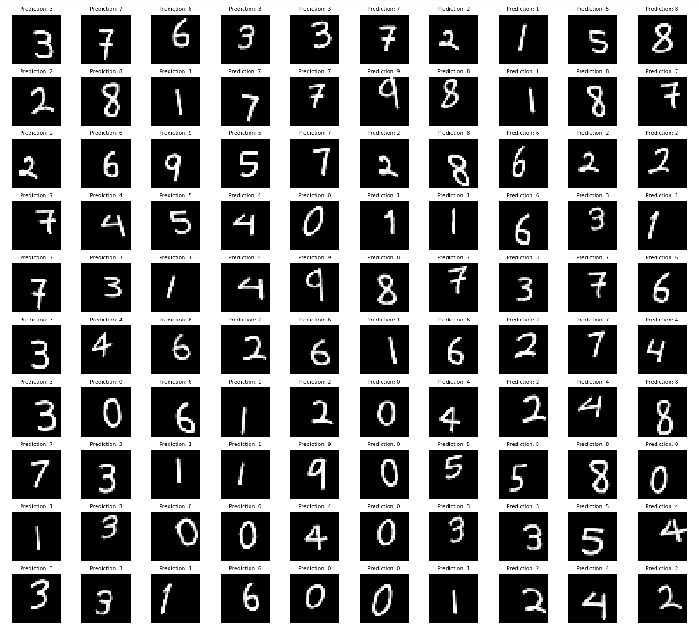

### README

# 使用 PyTorch 实现 CNN

这个项目旨在通过手把手的指导，为初学者提供一个清晰的卷积神经网络（CNN）实现示范。作者发现，网络上大多数教程都默认读者具备一定的代码阅读能力，即便是讲解透彻的教材却缺乏实践代码的真正一步一步的指导。因此，本项目通过完整的部署，帮助初学者建立规范的编码实践，以便日后的阅读和扩展。PyTorch 的使用基本大同小异，许多复杂的模型也是基于基本的模型部署技能。本项目将详尽的解释与模块化的部署结合，给初学者提供一个明晰的示范。

## 项目结构

```
.
├── data
│   └── dataset
├── image
│   └── CNN_results.png
├── README.MD
├── src
│   ├── data
│   ├── inference
│   ├── __init__.py
│   ├── model
│   ├── __pycache__
│   ├── runs
│   ├── training
│   └── util
└── train.py
```

## 模块描述

### data
- **CNN_Dataset.py**: 定义了 `CNN_Dataset` 类，用于加载和处理图像数据，包括数据增强和标准化。

### inference
- **CNN_Inference.py**: 包含 `load_model` 函数，用于从检查点加载训练好的模型。

### model
- **CNNModel.py**: 定义了 `CNNModel` 类，包含此项目中使用的 CNN 的架构。

### training
- **train_CNN.py**: 包含 `train` 函数，用于训练模型，以及 `create_dataloader` 函数，用于创建训练和验证数据加载器。

### util
- **visualization.py**: 包含用于可视化训练历史 (`plot_training_history`) 和模型预测 (`plot_predictions`) 的函数。
- **model.py**: 包含 `summarize_model` 函数，用于打印模型的摘要。

### 主脚本
- **train.py**: 主脚本，用于训练和评估模型。处理数据集加载、模型实例化、训练和评估。

## 环境需求

- Python 3.11
- PyTorch 2.0.0
- torchvision 0.15.0
- matplotlib 3.6.2
- numpy 1.23.5
- scikit-learn 1.1.3
- pillow 9.4.0

可以使用以下命令安装所需的软件包：
```
pip install -r requirements.txt
```

## 快速开始

### Conda 环境设置

1. **删除现有环境（如果有）**：
    ```bash
    conda remove -n cnn --all
    ```

2. **创建一个新的 Python 3.11 环境**：
    ```bash
    conda create -n cnn python=3.11
    ```

3. **激活新环境**：
    ```bash
    conda activate cnn
    ```

4. **安装所需软件包**：
    ```bash
    pip install -r requirements.txt
    ```

### 数据集准备

确保您的数据集在 `data/dataset` 目录中结构正确，每个类别（0, 1, 2, ..., 9）都有对应的子目录，其中包含相应的图像。

示例目录结构：

```
data/
└── dataset/
    ├── 0/
    ├── 1/
    ├── 2/
    ├── 3/
    ├── 4/
    ├── 5/
    ├── 6/
    ├── 7/
    ├── 8/
    └── 9/
```

### 训练模型

运行 `train.py` 脚本来训练模型。该脚本将检查是否存在预训练模型。如果找到，它会询问是否使用它或训练一个新模型。

```bash
python train.py
```

### 可视化结果

训练完成后，脚本将：
1. 绘制训练和验证损失及准确率曲线。
2. 显示一个带有预测标签的图像网格。

结果将在一个窗口中显示，并可以保存为图像。

### 示例结果

以下是输出结果的示例，显示了模型对一组图像的预测：



## 函数概览

### `CNN_Dataset`
- **`__init__(self, root_dir, transform=None, train=True, train_ratio=0.8)`**:
    通过加载图像路径和标签初始化数据集，并将数据拆分为训练集和验证集。
- **`__getitem__(self, idx)`**:
    返回预处理后的图像及其标签。
- **`__len__(self)`**:
    返回数据集中图像的总数。

### `load_model`
- **`load_model(model_path)`**:
    从指定路径加载已训练的模型。

### `CNNModel`
- **`__init__(self)`**:
    初始化 CNN 的层。
- **`forward(self, x)`**:
    定义网络的前向传播。

### `train`
- **`train(model, trainloader, valloader, criterion, optimizer, device, epochs=5)`**:
    使用指定的参数训练模型并记录训练历史。

### `create_dataloader`
- **`create_dataloader(root_dir, transform, batch_size=64, train=True, train_ratio=0.8)`**:
    为训练和验证数据集创建数据加载器。

### `plot_predictions`
- **`plot_predictions(model, dataloader, device)`**:
    在图像网格上绘制模型的预测结果。

### `plot_training_history`
- **`plot_training_history(history)`**:
    绘制训练和验证过程中的损失和准确率随时间的变化。

### `summarize_model`
- **`summarize_model(model)`**:
    打印模型的层和参数摘要。

## 结论

这个项目提供了一个使用 PyTorch 实现的 CNN 的完整实现，包括数据处理、训练、评估和可视化功能。通过手把手的指导，帮助初学者建立规范的编码实践，以便日后的阅读和扩展。模块化结构便于扩展和修改，使其成为进一步开发图像分类任务的坚实基础。
